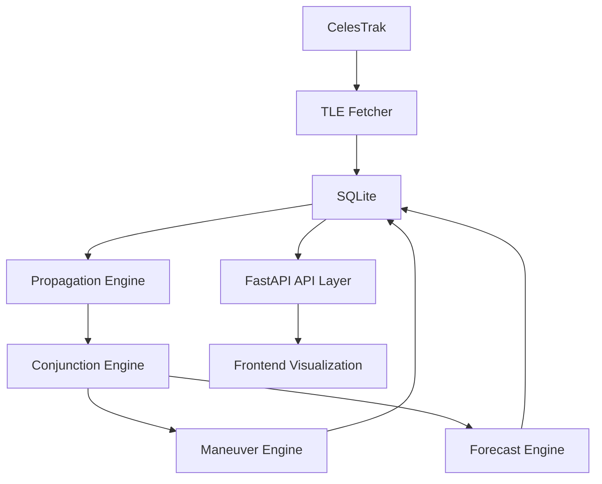

# OrbitWatch

Real-time Starlink satellite collision detection, risk assessment, and maneuver recommendation platform.

## Overview

OrbitWatch is a real-time Starlink collision-risk intelligence platform that combines orbital mechanics, spatial search, and full-stack engineering into a single end-to-end system.

It is designed to:

- Ingest live Starlink TLE data
- Propagate satellite orbits using SGP4
- Detect close approaches using KDTree spatial screening
- Compute collision risk metrics
- Generate maneuver recommendations
- Provide real-time visualization and analytics

The project emphasizes measurable performance, reproducible benchmarking, and practical engineering trade-offs for large satellite catalogs.

## Why OrbitWatch?

Low Earth Orbit is becoming increasingly congested as large satellite constellations continue to expand. Conjunction analysis at this scale requires algorithms that remain fast as catalog size grows, while still preserving physically meaningful risk ranking.

OrbitWatch was built to address that need by combining live TLE ingestion, SGP4 orbital propagation, and KDTree-based spatial screening in a reproducible pipeline. Using real CelesTrak data keeps the analysis grounded in operational satellite behavior rather than synthetic assumptions.

## Key Features

- Live tracking and ingestion of 10,000+ Starlink satellites from CelesTrak
- Batch SGP4 propagation for ECI position and velocity state vectors
- KDTree-based conjunction screening over propagated satellite positions
- Risk scoring model based on miss distance, relative velocity, and time-to-closest-approach
- Maneuver recommendation engine with delta-V estimates for high-risk events
- Forecasting pipeline for upcoming close-approach windows
- Analytics dashboard for risk distribution and operational summaries
- Interactive 3D globe visualization built with Three.js
- Export tools for conjunction and maneuver data in CSV and JSON

## Screenshots

Representative interface captures can be added at:

- docs/screenshots/globe.png
- docs/screenshots/dashboard.png
- docs/screenshots/maneuvers.png

## System Architecture



Architecture flow and responsibilities:

- CelesTrak: Source of live Starlink TLEs.
- TLE Fetcher: Pulls, validates, and upserts orbital elements into SQLite on a scheduled cycle.
- SQLite: Stores canonical satellite records plus derived conjunction, maneuver, and forecast results.
- Propagation Engine: Runs SGP4 batch propagation to compute ECI positions and velocities.
- Conjunction Engine: Builds a single KDTree over propagated positions, screens close approaches, and computes risk and TCA.
- Maneuver Engine: Generates delta-V recommendations for high-risk conjunction pairs.
- Forecast Engine: Produces near-term predicted encounter events and stores sortable timeline records.
- FastAPI API Layer: Serves precomputed data through low-latency REST endpoints.
- Frontend Visualization: Displays live globe, analytics, alerts, and operator-facing inspection tools.

## Performance Highlights

| Metric | Result |
|---|---|
| Catalog size processed | 10,000+ satellites |
| End-to-end pipeline time (excluding network) | 472.6 ms |
| SGP4 propagation stage | 208.2 ms |
| Conjunction screening stage | 87.7 ms |
| Maneuver generation stage | 17.1 ms |
| KDTree speedup vs brute force | 11,275.8x |

These measurements are derived from repeatable benchmark artifacts in the repository.

## Research Contributions

- KDTree vs brute-force comparison: Quantifies asymptotic and practical speedup on large Starlink-scale catalogs.
- Completeness validation: Confirms that optimized screening preserves relevant conjunction candidates.
- Pipeline benchmarking: Breaks down total runtime by stage to identify compute bottlenecks.
- Reproducible results: Ships benchmark JSON outputs and analysis scripts for independent verification.

## Technology Stack

| Layer | Technologies |
|---|---|
| Backend API | Python, FastAPI, Uvicorn |
| Orbital Mechanics | python-sgp4, NumPy, SciPy |
| Spatial Screening | SciPy KDTree |
| Data Store | SQLite (WAL mode) |
| Scheduling | APScheduler |
| Frontend 3D | Three.js |
| Browser Propagation | satellite.js |
| Analytics UI | Chart.js |
| Data Source | CelesTrak |

## Database Schema

OrbitWatch uses SQLite with four core tables:

- satellites: Canonical TLE records for each tracked Starlink object.
- conjunctions: Detected close-approach events with miss distance, relative velocity, risk score, and TCA.
- maneuvers: Recommended corrective actions with delta-V estimates linked to conjunction events.
- forecast: Predicted upcoming approach events, sorted by future encounter time.

The schema is indexed for risk-based ranking, pair lookup, and forecast timeline queries.

## Risk Scoring Model

```text
risk_score = (1 / (distance_km + 1))
           * (relative_velocity_km_s / 15)
           * (1 / (time_to_closest_approach_s + 1))
```

Where:

- distance_km: Predicted miss distance between two satellites. Smaller distance increases risk.
- relative_velocity_km_s: Closing speed at encounter. Higher velocity increases hazard severity.
- time_to_closest_approach_s: Time remaining until TCA. Lower time increases operational urgency.

This model is intentionally interpretable and operationally useful for ranking conjunction priority.

## API Endpoints

| Method | Endpoint | Description |
|---|---|---|
| GET | /api/v1/tles | Return live Starlink TLE records |
| GET | /api/v1/conjunctions | Return risk-sorted conjunction events |
| GET | /api/v1/analytics | Return aggregate risk and catalog statistics |
| GET | /api/v1/maneuvers | Return maneuver recommendations |
| GET | /api/v1/maneuvers/{conjunction_id} | Return detailed maneuver for one conjunction |
| GET | /api/v1/forecast | Return upcoming predicted conjunction timeline |
| GET | /health | Service health status |

Interactive API documentation is available at /docs.

## Project Structure

```text
OrbitWatcher/
├── config.py                         # Global constants: thresholds, paths, API prefix, source URLs
├── logger.py                         # Centralized logging configuration
├── requirements.txt                  # Python dependencies
├── README.md
├── LICENSE
│
├── backend/
│   ├── main.py                       # FastAPI entrypoint, middleware, router registration
│   ├── database.py                   # SQLite initialization, WAL settings, schema and indexes
│   ├── scheduler.py                  # Pipeline orchestration and periodic execution
│   ├── benchmark.py                  # Runtime benchmarking routines
│   ├── generate_figures.py           # Benchmark visualization generation
│   │
│   ├── routes/
│   │   ├── satellites.py             # /api/v1/tles
│   │   ├── conjunctions.py           # /api/v1/conjunctions
│   │   ├── analytics.py              # /api/v1/analytics
│   │   ├── maneuvers.py              # /api/v1/maneuvers, /api/v1/maneuvers/{conjunction_id}
│   │   └── forecast.py               # /api/v1/forecast
│   │
│   └── services/
│       ├── tle_fetcher.py            # CelesTrak ingestion, validation, persistence
│       ├── propagator.py             # SGP4 propagation and state-vector generation
│       ├── conjunction.py            # KDTree-based conjunction screening and risk scoring
│       ├── conjunction_bruteforce.py # Baseline O(n^2) reference for validation/benchmarking
│       ├── optimizer.py              # Maneuver delta-V estimation and recommendation text
│       └── forecaster.py             # Forecast generation for upcoming approach events
│
├── frontend/
│   ├── index.html                    # Single-page interface shell
│   ├── VISUALIZATION_MODES.md        # UI mode documentation
│   ├── css/
│   │   └── style.css                 # Presentation layer styles
│   └── js/
│       ├── main.js                   # App bootstrap and lifecycle wiring
│       ├── api.js                    # Backend request layer
│       ├── globe.js                  # 3D scene, camera, rendering controls
│       ├── satellites.js             # Satellite rendering and visual state updates
│       ├── conjunctions.js           # Conjunction data loading and presentation
│       ├── maneuver.js               # Maneuver panel data and interaction logic
│       ├── forecast.js               # Forecast visualization and timeline handling
│       ├── dashboard.js              # Analytics charts and KPI cards
│       ├── alerts.js                 # Alert feed behavior
│       ├── inspector.js              # Object inspection panel
│       ├── filters.js                # Data filtering controls
│       ├── search.js                 # Search and object selection workflows
│       ├── export.js                 # CSV/JSON export utilities
│       └── router.js                 # View routing between dashboard panels
│
├── data/                             # Data artifacts and local datasets
├── logs/                             # Runtime logs
├── benchmark_scalability.json        # Scalability benchmark output
├── benchmark_completeness.json       # Completeness benchmark output
└── pipeline_timing.json              # Stage-wise pipeline timing output
```

## Installation

Prerequisites:

- Python 3.10+
- Git

Setup:

```bash
git clone https://github.com/ssr0231/OrbitWatcher.git
cd OrbitWatcher
pip install -r requirements.txt
uvicorn backend.main:app --reload --host 0.0.0.0 --port 8000
```

## Running the Project

After startup, open http://localhost:8000.

On boot, OrbitWatch automatically executes:

1. TLE ingestion from CelesTrak
2. SGP4 propagation for all active objects
3. KDTree conjunction screening and risk scoring
4. Maneuver and forecast generation

The scheduler then refreshes the pipeline periodically for near-real-time updates.

## Future Enhancements

- Multi-operator satellite catalogs beyond Starlink
- Improved collision probability and uncertainty propagation models
- Historical conjunction analytics for trend and anomaly analysis
- Containerized deployment profile for reproducible environments

## Project Highlights

- Processes 10,000+ satellites in a benchmarked end-to-end pipeline
- KDTree acceleration for scalable conjunction candidate screening
- SGP4 propagation for physically grounded orbital state estimation
- Risk assessment engine combining distance, relative velocity, and TCA
- Maneuver recommendation workflow for high-priority conjunctions
- Interactive 3D visualization for catalog and event exploration
- Reproducible benchmark artifacts for independent performance validation

## License

This project is licensed under the MIT License. See the LICENSE file for details.

## Author

Shubham Singh  
Final-year Computer Science & Engineering student

Focus areas:

- Orbital Mechanics
- Spatial Algorithms
- Collision Risk Analysis
- Full Stack Engineering
- Scientific Visualization

