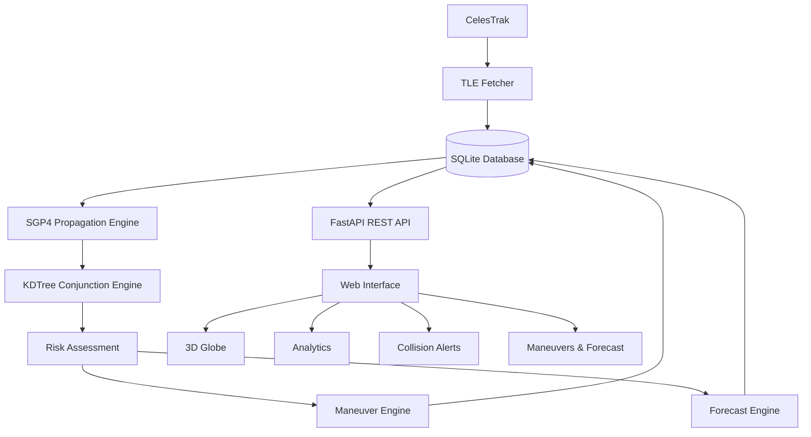

# OrbitWatch

**Real-time Starlink satellite collision risk intelligence, conjunction analysis, and maneuver recommendation platform.**

OrbitWatch is an end-to-end space situational awareness platform that ingests live Starlink orbital data, propagates 10,000+ satellite orbits using SGP4, detects close approaches using KDTree spatial screening, evaluates collision risk, generates maneuver recommendations, forecasts upcoming encounters, and visualizes the results through an interactive 3D mission-control interface.

---

## Overview

Low Earth Orbit (LEO) is becoming increasingly congested as large satellite constellations continue to expand. Screening thousands of objects for potential close approaches requires efficient algorithms that can scale with catalog size while still providing meaningful risk information.

OrbitWatch combines:

- Live TLE ingestion from CelesTrak
- SGP4 orbital propagation
- KDTree-based conjunction screening
- Collision risk ranking
- Maneuver recommendation generation
- 24-hour conjunction forecasting
- Interactive 3D satellite visualization
- Analytics and operational dashboards
- REST API access
- Docker-based deployment

The project emphasizes scalable computation, interpretable risk assessment, reproducible benchmarking, and practical full-stack engineering.

---

## Key Features

- Tracks **10,000+ Starlink satellites** using TLE data from CelesTrak
- Batch SGP4 propagation for satellite position and velocity state vectors
- KDTree spatial screening for scalable conjunction detection
- Risk scoring based on miss distance, relative velocity, and time to closest approach
- Delta-V maneuver recommendations for high-risk conjunctions
- 24-hour forecasting pipeline for upcoming encounters
- Interactive Three.js 3D globe visualization
- Satellite search, filtering, inspection, and orbit visualization
- Collision alert interface
- Analytics dashboard with risk and catalog statistics
- CSV and JSON export tools
- Scheduled automatic pipeline refresh
- SQLite persistence with WAL mode
- Health monitoring endpoint
- Docker and Docker Compose deployment support
- Fallback to stored orbital data when fresh TLE retrieval is unavailable

---

## Screenshots

Screenshots of the globe, analytics dashboard, collision alerts, maneuver panel, and forecast interface can be added to:

```text
docs/screenshots/
```

Suggested files:

```text
docs/screenshots/globe.png
docs/screenshots/dashboard.png
docs/screenshots/maneuvers.png
docs/screenshots/forecast.png
```

---

## Quick Start with Docker

The easiest way to run OrbitWatch is through Docker.

### Prerequisites

- Docker
- Docker Compose
- Git

Clone the repository:

```bash
git clone https://github.com/ssr0231/OrbitWatcher.git
cd OrbitWatcher
```

Start OrbitWatch:

```bash
docker compose up --build
```

Then open:

```text
http://localhost:8000
```

OrbitWatch initializes the database, attempts to retrieve current TLE data, executes the processing pipeline, and starts the background scheduler.

The SQLite database and application logs are persisted on the host through:

```text
./data/
./logs/
```

so they survive container recreation.

Stop the application with:

```bash
docker compose down
```

---

## Manual Installation

### Prerequisites

- Python 3.12
- Git

Clone the repository:

```bash
git clone https://github.com/ssr0231/OrbitWatcher.git
cd OrbitWatcher
```

Create a virtual environment:

```bash
python -m venv .venv
```

Activate it on Windows:

```powershell
.venv\Scripts\Activate.ps1
```

On macOS/Linux:

```bash
source .venv/bin/activate
```

Install dependencies:

```bash
pip install -r requirements.txt
```

Start OrbitWatch:

```bash
python run.py
```

Open:

```text
http://localhost:8000
```

Interactive API documentation is available at:

```text
http://localhost:8000/docs
```

---

## Configuration

OrbitWatch supports environment-based configuration so deployment settings can be changed without modifying application code.

Copy the example configuration:

### Windows PowerShell

```powershell
Copy-Item .env.example .env
```

### macOS/Linux

```bash
cp .env.example .env
```

A `.env` file is optional for local development because the application provides defaults.

### Key Environment Variables

| Variable | Default | Description |
|---|---|---|
| `HOST` | `0.0.0.0` | Network interface used by the application |
| `PORT` | `8000` | HTTP server port |
| `ALLOWED_ORIGINS` | `*` | Allowed CORS origins; configure explicitly for production |
| `DATABASE_PATH` | `data/orbitwatch.db` | SQLite database location |
| `LOG_LEVEL` | `INFO` | Application logging level |
| `LOG_FILE` | `logs/orbitwatch.log` | Rotating application log location |
| `SCHEDULER_INTERVAL_HOURS` | `6` | Pipeline refresh interval |
| `CONJUNCTION_THRESHOLD_KM` | `50.0` | Screening distance threshold |
| `RISK_ALERT_THRESHOLD` | `0.05` | Risk threshold used for alerts |

See `.env.example` for the complete configuration reference.

> For public deployment, replace `ALLOWED_ORIGINS=*` with the actual frontend/domain origin where appropriate.

---

## System Architecture


```mermaid
flowchart TD
    A[CelesTrak] --> B[TLE Fetcher]
    B --> C[(SQLite Database)]

    C --> D[SGP4 Propagation Engine]
    D --> E[KDTree Conjunction Engine]

    E --> F[Risk Assessment]
    F --> G[Maneuver Engine]
    F --> H[Forecast Engine]

    G --> C
    H --> C

    C --> I[FastAPI REST API]
    I --> J[Web Interface]

    J --> K[3D Globe]
    J --> L[Analytics]
    J --> M[Collision Alerts]
    J --> N[Maneuvers & Forecast]
```

### Processing Pipeline

```text
CelesTrak TLE Data
        │
        ▼
TLE Fetcher
        │
        ▼
SQLite Database
        │
        ▼
SGP4 Propagation
        │
        ▼
KDTree Spatial Screening
        │
        ▼
Conjunction Analysis
        │
        ├──► Risk Assessment
        │
        ├──► Maneuver Recommendations
        │
        └──► Forecast Generation
                    │
                    ▼
                Database
                    │
                    ▼
               FastAPI API
                    │
                    ▼
            Mission-Control UI
```

### Core Components

| Component | Responsibility |
|---|---|
| **CelesTrak** | Source of Starlink TLE orbital elements |
| **TLE Fetcher** | Retrieves, validates, retries, and stores orbital data |
| **SQLite** | Stores satellites, conjunctions, maneuvers, and forecasts |
| **Propagation Engine** | Uses SGP4 to calculate satellite state vectors |
| **Conjunction Engine** | Uses KDTree spatial screening to identify close approaches |
| **Risk Engine** | Ranks conjunctions using distance, velocity, and TCA |
| **Maneuver Engine** | Generates delta-V-based maneuver recommendations |
| **Forecast Engine** | Predicts upcoming encounter events |
| **FastAPI Layer** | Exposes processed data through REST endpoints |
| **Frontend** | Provides 3D visualization, analytics, alerts, and inspection tools |

---

## Performance

OrbitWatch includes reproducible benchmark tooling for evaluating scalability and pipeline performance.

| Metric | Result |
|---|---:|
| Catalog size processed | 10,000+ satellites |
| End-to-end pipeline time (excluding network) | 472.6 ms |
| SGP4 propagation stage | 208.2 ms |
| Conjunction screening stage | 87.7 ms |
| Maneuver generation stage | 17.1 ms |
| KDTree speedup vs brute force | 11,275.8× |

Benchmark methodology, scripts, and result artifacts are maintained under:

```text
docs/research/
```

Results depend on the benchmark environment and should be interpreted in the context of the documented test configuration.

---

## Risk Scoring Model

OrbitWatch uses an interpretable ranking model:

```text
risk_score = (1 / (distance_km + 1))
           × (relative_velocity_km_s / 15)
           × (1 / (time_to_closest_approach_s + 1))
```

Where:

| Factor | Interpretation |
|---|---|
| `distance_km` | Smaller miss distance increases risk |
| `relative_velocity_km_s` | Higher relative velocity increases encounter severity |
| `time_to_closest_approach_s` | Less remaining time increases operational urgency |

The score is intended for **relative prioritization of conjunction events**. It is not an absolute physical probability of collision.

---

## API Reference

OrbitWatch exposes a REST API through FastAPI.

Interactive Swagger documentation is available at:

```text
/docs
```

### Endpoints

| Method | Endpoint | Parameters | Description |
|---|---|---|---|
| GET | `/api/v1/tles` | — | Retrieve Starlink TLE records |
| GET | `/api/v1/conjunctions` | `limit` | Retrieve risk-ranked conjunction events |
| GET | `/api/v1/analytics` | — | Retrieve aggregate risk and catalog statistics |
| GET | `/api/v1/maneuvers` | `limit` | Retrieve maneuver recommendations |
| GET | `/api/v1/maneuvers/{conjunction_id}` | — | Retrieve maneuver details for a conjunction |
| GET | `/api/v1/forecast` | `limit` | Retrieve predicted upcoming encounters |
| GET | `/health` | — | Application and database health probe |

The validated limits currently documented by the application are:

| Endpoint | Allowed `limit` | Default |
|---|---:|---:|
| `/api/v1/conjunctions` | 1–500 | 100 |
| `/api/v1/maneuvers` | 1–500 | 50 |
| `/api/v1/forecast` | 1–500 | 200 |

### Health Check

Request:

```http
GET /health
```

Healthy response:

```json
{
  "status": "ok",
  "version": "1.0.0",
  "database": "ok"
}
```

The endpoint is used by the Docker health check and can also be used by deployment platforms, load balancers, and uptime monitoring services.

---

## Database

OrbitWatch uses SQLite with WAL mode for lightweight persistence and efficient concurrent reads.

### Core Tables

| Table | Purpose |
|---|---|
| `satellites` | Canonical TLE records for tracked Starlink satellites |
| `conjunctions` | Detected close approaches and calculated risk information |
| `maneuvers` | Maneuver recommendations associated with conjunction events |
| `forecast` | Predicted upcoming conjunction events |

The database includes indexes for frequently queried risk, satellite-pair, and forecast data.

Database initialization and schema validation happen automatically during application startup.

---

## Technology Stack

| Layer | Technologies |
|---|---|
| Backend | Python 3.12, FastAPI, Uvicorn |
| Orbital Propagation | python-sgp4 |
| Scientific Computing | NumPy, SciPy |
| Spatial Screening | SciPy KDTree |
| Database | SQLite, WAL mode |
| Scheduling | APScheduler |
| 3D Visualization | Three.js |
| Browser Orbital Processing | satellite.js |
| Analytics | Chart.js |
| Containerization | Docker, Docker Compose |
| Data Source | CelesTrak |
| API Documentation | OpenAPI / Swagger UI |

---

## Project Structure

```text
OrbitWatcher/
│
├── config.py
├── logger.py
├── run.py
│
├── requirements.txt
├── requirements.prod.txt
├── pyproject.toml
│
├── Dockerfile
├── docker-compose.yml
├── .dockerignore
├── .env.example
├── .gitignore
│
├── README.md
├── LICENSE
│
├── backend/
│   ├── main.py
│   ├── database.py
│   ├── scheduler.py
│   │
│   ├── routes/
│   │   ├── satellites.py
│   │   ├── conjunctions.py
│   │   ├── analytics.py
│   │   ├── maneuvers.py
│   │   └── forecast.py
│   │
│   └── services/
│       ├── tle_fetcher.py
│       ├── propagator.py
│       ├── conjunction.py
│       ├── optimizer.py
│       └── forecaster.py
│
├── frontend/
│   ├── index.html
│   │
│   ├── css/
│   │   └── style.css
│   │
│   └── js/
│       ├── main.js
│       ├── api.js
│       ├── globe.js
│       ├── satellites.js
│       ├── conjunctions.js
│       ├── alerts.js
│       ├── inspector.js
│       ├── dashboard.js
│       ├── maneuver.js
│       ├── forecast.js
│       ├── filters.js
│       ├── search.js
│       ├── export.js
│       ├── panel-manager.js
│       └── router.js
│
├── data/
├── logs/
│
└── docs/
    ├── Mission_Control_Vision.md
    │
    └── research/
        ├── benchmark.py
        ├── generate_figures.py
        ├── conjunction_bruteforce.py
        ├── benchmark_scalability.json
        ├── benchmark_completeness.json
        └── pipeline_timing.json
```

---

## Research and Benchmarking

OrbitWatch also serves as an experimental platform for evaluating scalable conjunction-screening approaches.

### Research Contributions

**KDTree vs brute-force comparison**

A brute-force conjunction search grows approximately as:

```text
O(n²)
```

OrbitWatch uses KDTree-based spatial screening to reduce unnecessary pair comparisons and improve scalability for large satellite catalogs.

**Completeness validation**

The optimized conjunction-screening pipeline is compared against a brute-force reference implementation to validate candidate detection.

**Pipeline benchmarking**

Individual stages—including propagation, conjunction screening, and maneuver generation—are benchmarked separately to identify computational bottlenecks.

**Reproducibility**

Benchmark scripts and result artifacts are stored under:

```text
docs/research/
```

to support independent analysis and research-paper development.

---

## Reliability and Deployment

OrbitWatch includes several features intended to make the application more robust in deployment environments:

- Environment-driven configuration
- Centralized logging with rotation
- SQLite WAL mode and indexed queries
- Database health checking
- Global API exception handling
- API input validation
- External request timeouts and retry logic
- Persisted orbital data fallback when upstream retrieval fails
- Docker health monitoring
- Persistent database and log volumes
- Non-root container execution
- Graceful application shutdown

---

## Limitations

OrbitWatch is currently focused on Starlink TLE data and conjunction screening based on publicly available orbital elements.

The current risk score is an interpretable prioritization heuristic and **not a certified collision-probability model**. Maneuver recommendations are analytical suggestions and should not be treated as operational flight commands.

TLE accuracy, propagation uncertainty, covariance information, spacecraft dimensions, operator constraints, and other operational factors can materially affect real-world collision assessment.

OrbitWatch is intended for research, education, engineering experimentation, and visualization rather than operational spacecraft control.

---

## Future Enhancements

Potential future work includes:

- Support for multi-operator satellite catalogs beyond Starlink
- Covariance-aware collision probability estimation
- Improved uncertainty propagation
- Historical conjunction analytics
- Operator-specific maneuver constraints
- More advanced maneuver optimization
- Authentication and authorization for hosted deployments
- PostgreSQL support for larger multi-user deployments
- Expanded monitoring and observability
- Automated CI/CD deployment workflows

---

## Project Highlights

- Processes **10,000+ satellites** in a benchmarked pipeline
- Uses SGP4 for physically grounded orbital propagation
- Uses KDTree acceleration for scalable conjunction screening
- Achieved **11,275.8× measured screening speedup** against the benchmarked brute-force implementation
- Generates risk-ranked conjunction events
- Produces delta-V maneuver recommendations
- Forecasts upcoming close approaches
- Provides an interactive 3D mission-control interface
- Exposes processed data through a FastAPI REST API
- Supports Docker-based portable deployment
- Includes reproducible benchmark artifacts

---

## License

This project is licensed under the **MIT License**.

See `LICENSE` for details.

---

## Author

**Shubham Singh**  
Final-year Computer Science & Engineering student

Areas of focus:

- Orbital Mechanics
- Spatial Algorithms
- Collision Risk Analysis
- Full Stack Engineering
- Scientific Visualization